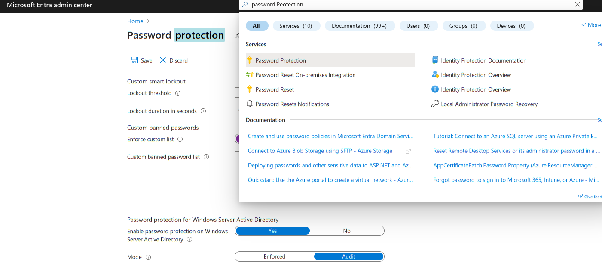
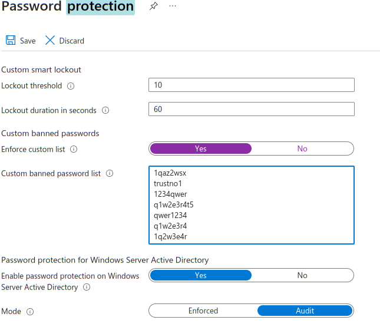

# 📓 Configure Microsoft 365 with PowerShell
In this repository, you'll find everything you need to configure Microsoft 365 via PowerShell. 
Find out more about :
- Exchange configuration and security best practices.
- User creation, management and licensing.
- Creating groups, assigning users to the right groups and setting up group leaders.
- Creating policies, localization requirements and best practices to secure your 365 environment.
- How to set up a password blacklist for users.
- Activate MFA

**Script :**
I started with a basic configuration of the 3 groups *Administrator, Manager, SimpleUsers*.

The **UserAndExchange.ps1** script automates exchange configuration, user creation, group creation and assignment of users to the right group. 


The **Policy.ps1** script automates the creation of access conditions and location zones.

## 📋 Requirements

- Basic knowledge of PowerShell
- A Microsoft 365 administrator account
- A PowerShell administrator account

## 📌 Installation

During configuration, you will use the following modules:
- AzureADPreview
- MSOnline
- ExchangeOnlineManagement
- Microsoft Graph
- Microsoft.Online.SharePoint.PowerShell

```PowerShell
$moduleToInstall = "AzureADPreview", "MSOnline", "ExchangeOnlineManagement", "Microsoft.Graph", "Microsoft.Online.SharePoint.PowerShell"
Install-Module -Name $moduleToInstall -Force -AllowClobber
Import-Module -Name $moduleToInstall
```
⚠️ **Note :** You may encounter a problem when installing in this way. Try installing the modules 1 by 1

## Connection

```PowerShell
Connect-MsolService
Connect-ExchangeOnline -UserPrincipalName example@28pd65.onmicrosoft.com
Connect-AzureAD
```
⚠️ **Note :** log in when creating Microsoft users.Graph

## 📧 Exchange

In Exchange, you can configure :
- setting an `extern` tag on emails
- Block potentially dangerous extensions
- Create green and/or black lists
- Limit the number and size of e-mails sent and received
- Create lists that block or approve senders.
- Authorize or block URLs
- etc.
I'm concentrating on a basic configuration that's easy to set up and adaptable to the greatest number of people.

1. **Extern tag**
The `extern` tag allows you to see whether e-mails are coming from the outside or the inside.
```PowerShell
Set-ExternalInOutlook -Enabled $true
```
- To check if it has been configured correctly
```powershell
Get-ExternalInOutlook | Format-Table
```
2. **Create a security rule that will block potentially dangerous file extensions (e.g. .cmd, .py, etc.).** 
When have created a rule that blocks potentially dangerous extensions. You can send a message to the sender. It is advisable not to explain the reason for refusing to send the message, to prevent the sender from adapting his e-mail to the responses. A message like **"The message could not be sent."** are the best option.
- **The standard method :**
```powershell
New-TransportRule -Name "Extension block" -AttachmentNameMatchesPatterns @(".sh", ".py", "cmd", etc.) -RejectMessageReasonText "The message could not be sent." -Mode "Enforce"
```
⚠️ **Note:** There is a file **extensions.csv** with an exhaustive list of extensions to block.
- **The optimized method :**
```powershell
$extensions = Import-Csv -Path "./csv-file/extension.csv"
foreach ($extension in $extensions){
    $extensionName = $extension.Extension.Trim()
    $ruleName = "Block $extensionName files"
    New-TransportRule -Name $ruleName -AttachmentNameMatchesPatterns @($extensionName) -RejectMessageReasonText "The message could not be sent." -Mode "Enforce"
}
```
- To check if it has been configured correctly
```powershell
Get-TransportRule | Format-Table Name,RejectMessageReasonText,AttachmentNameMatchesPatterns
```


## 👤 User creation

To manage users, you must be connected to :
- **AzureAD**
- **Microsoft.Graph**
- **ExchangeOnLine.**
To create users, I advise you to go directly to the script box. The simple method works for a few users, but if the number is substantial, it becomes complicated.

- **The standard method :**
```powershell
$userName = "User Name"
$userPrincipalName = "User@24pd52.onmicrosoft.com"
$userPassword = "UserPassword"
$mailNickname = "mail"
$location = "BE"
$securePassword = ConvertTo-SecureString -String $userPassword -AsPlainText -Force
$newUser = New-AzureADUser -DisplayName $userName -UserPrincipalName $userPrincipalName -UserType Member -PasswordProfile @{ Password = $securePassword; ForceChangePasswordNextLogin = $false } -MailNickname $mailNickname -UsageLocation $location -AccountEnabled $true
```
⚠️ **Note :** `$location` is necessary if you want to add a license later.

⚠️ **Note :** Change `ForceChangePasswordNextLoginen` in `$true` to force user to change password on login 

⚠️ **Note :** At this stage, users do not yet have email addresses. To get one, you need a license that will give you access to exchange

- **The optimized method :**
```powershell
$users = Import-Csv -Path "./csv-file/user.csv"

foreach ($user in $users) {
    $SecurePassword = ConvertTo-SecureString -String $user.Password -AsPlainText -Force

    New-AzureADUser -DisplayName $user.DisplayName -UserPrincipalName $user.UserPrincipalName -UserType Member -PasswordProfile @{ Password = $SecurePassword; ForceChangePasswordNextLogin = $false} -MailNickname user.MailNickname -UsageLocation $user.location -AccountEnabled $true
}
```
- To check that everything has been properly configured

```powershell
Get-AzureADUser
```
Now you need to add at least one license giving access to exchange.

To add the license, you need the **user ID** and the **SkuID** of the license.

1. **Connection**
```powershell
Connect-MgGraph -Scopes User.ReadWrite.All, Organization.Read.All
```
2. **Get User ID**
```powershell
Get-MgUser
```
3. **Get SkuID**
```powershell
Get-AzureADSubscribedSku
```
4. **Add license**
```powershell
Set-MgUserLicense -UserId "id user" -AddLicenses @{SkuId = "licence id"} -RemoveLicenses @()
```
- To check that everything has been properly configured

```powershell
Get-MgUser -Filter 'assignedLicenses/$count eq 0' -ConsistencyLevel eventual -CountVariable unlicensedUserCount -All
```
## 👥 Group creation

To manage groups, you must be logged in to :

- **AzureAD**
- **ExchangeOnLine**

Groups are a good way of assigning permissions and access to applications. Instead of giving rights to each user separately, we'll give those rights to the group and add users to the right group, making it easier to manage who has access to what.

There are several "types" of group, but here I'm concentrating on groups at the "*Admin center "* level.

1. Group creation**
```powershell
New-UnifiedGroup -DisplayName "name" -Alias "Alias" -Notes "description"
```
2. **Add users to group**
```powershell
Add-UnifiedGroupLinks -Identity "Groupe name" -LinkType Members -Links name@24pd52.onmicrosoft.com
```
⚠️ **Note :** To get the links, just do `Get-AzureADUser`.

3. **Add owner group members**
```powershell
Add-UnifiedGroupLinks -Identity "Groupe name" -LinkType Owners -Links name@24pd52.onmicrosoft.com
```
⚠️ **Note :** You absolutely have to be a member of a group to become an owner.

- To check that everything has been properly configured
```powershell
# Check group list
Get-AzureADGroup

# Check the list of users in a group
Get-azureADGroupMember -ObjectId <id>
```
## 🗒️ Black list Password

To create a blacklist of passwords, I unfortunately couldn't find a way to do it in PowerShell, but it's easy to do in the GUI.

⚠️ If, when creating a user, you chose to set `ForceChangePasswordNextLogin = $true` then don't forget this step.

If not, do this step anyway, to avoid passwords that are too easy to crack.


You can create a blacklist of 1000 words.

The first 1000 words of the **seclists** `xato-net-10-million-passwords-1000000.txt` list that contain at least :
- 8 alphanumeric characters
- One letter after the numbers
- One digit after the letters.
Found in `azure365-black-list-1000.txt`





## 🔐 MFA

To manage mfa, you must be logged in to :
- **MsolService**

Let's take a look at how to configure MFA so that the next time users log on, they are prompted to do so. If they have already done so, they will be prompted to complete the MFA request.

- **Enabled MFA for a single user**
```powershell
$sa = New-Object -TypeName Microsoft.Online.Administration.StrongAuthenticationRequirement
$sa.RelyingParty = "*"
$sa.State = "Enabled"
$sar = @($sa)
$user = "user@24pd52.onmicrosoft.com"

Set-MsolUser -UserPrincipalName $user -StrongAuthenticationRequirements $sar
```
- **Enabled MFA for a all users**
```powershell
$sa = New-Object -TypeName Microsoft.Online.Administration.StrongAuthenticationRequirement
$sa.RelyingParty = "*"
$sa.State = "Enabled"
$sar = @($sa)

Get-MsolUser -All | Set-MsolUser -StrongAuthenticationRequirements $mfa
 ```
⚠️ **Note :** It's impossible to make MFA `enforced` from the outset. However, once a user has configured it, it becomes `enforced`.

- To check that everything has been properly configured (The MFA method will be visible only when the user selects it, not before.)
```powershell
Get-MsolUser | Select-Object -Property UserPrincipalName, StrongAuthenticationMethods
```


## 🚨 Policy

The purpose of access conditions is to make access to certain applications and data more complex. This provides a higher level of security. However, you have to be careful, as they can quickly become disturbing if you make them too "complex". 

For example: having the MFA and a predefined location zone to access the admin panel is a good practice. It's less so if you use it to access Microsoft Word.

📢 There are several steps, and this is a fairly important part of the security process. I'm going to create a fairly standard condition, but I strongly advise you to find out more about it and adapt it to your needs. Feel free to check the sources below.

⚠️ **Note:** the application **ids** displayed in PowerShell are not the same as in the GUI.  The ones that work are **THE GRAPHIC INTERFACE** which can be found in the file `files/App-infos.md`.

1. **Step 1 : Creating the authorization zone**

The first step is to create a geolocation zone or IP address range. This step will allow you to define the zone in which your apps will be used, or the IP addresses that will have access rights. This prevents someone from connecting to the admin panel in a country where they logically shouldn't.

- **Countries and Regions**
```powershell
New-AzureADMSNamedLocationPolicy -OdataType "#microsoft.graph.countryNamedLocation" -DisplayName "Country named location policy" -CountriesAndRegions "NL", "BE", "LU" -IncludeUnknownCountriesAndRegions $false
```
- **IpRange**
```powershell
$ipRanges = New-Object -TypeName Microsoft.Open.MSGraph.Model.IpRange
$ipRanges.cidrAddress = "IP/32"
New-AzureADMSNamedLocationPolicy -OdataType "#microsoft.graph.ipNamedLocation" -DisplayName "IP named location policy" -IsTrusted $false -IpRanges $ipRanges
```
2. **Step 2 : Creating access and control conditions**

⚠️ **Note:** There is also an advantage in creating groups appropriate to the access level, as access conditions can be assigned to users or groups. Once again, this simplifies the assignment of conditions.

Access conditions are the conditions that will be impacted by the policy, groups, users, application and location zone.

Control conditions define the method(s) by which applications can be accessed. 
Example: with MFA and location zone, where only one of the 2 options is sufficient. 

Now let's create an access condition using :
- **application id** `files/App-infos.md`
- **Group or user ids** `Get-MgUser`
- **Geolocation zone or IP address range rule id** `Get-AzureADMSNamedLocationPolicy`

```powershell
$conditions = New-Object -TypeName Microsoft.Open.MSGraph.Model.ConditionalAccessConditionSet
$conditions.Applications = New-Object -TypeName Microsoft.Open.MSGraph.Model.ConditionalAccessApplicationCondition
$conditions.Users.IncludeGroups = "id du groupe" # it's possible to change
$conditions.Locations = New-Object -TypeName Microsoft.Open.MSGraph.Model.ConditionalAccessLocationCondition
$conditions.Locations.IncludeLocations = "id de la règle localisation"
$controls = New-Object -TypeName Microsoft.Open.MSGraph.Model.ConditionalAccessGrantControls
$controls._Operator = "OR" # it's possible to change
$controls.BuiltInControls = "mfa" # it's possible to change

New-AzureADMSConditionalAccessPolicy -DisplayName "Policy name" -State "Enabled" -Conditions $conditions -GrantControls $controls
```
⚠️ **Note :** If the aim is to assign the policy to one user, you'll need to set his `id`, whereas if the aim is for it to apply to everyone, you'll need to set `All`. This gives : `$conditions.Users.IncludeUsers = "id user / All"`

⚠️ **Note :** We can change the `$controls._Operator = "OR"` to `$controls._Operator = "AND"` which makes it necessary to respect the locations rule and the MFA.

⚠️ **Note :** You can change the `$controls.BuiltInControls = "mfa"` to `$controls.BuiltInControls = "block"` to block the MFA.

⚠️ **Note :** It is possible to create policies without activating them, just change `-State "Enabled"` to `-State "Disabled"`.

## 🚑 Support

It is possible to encounter errors when installing `Microsoft.Graph`.

One solution is to completely uninstall microsoft.graph :

```powershell
Uninstall-Module -Name Microsoft.Graph
```
Then check that everything has been uninstalled. If not, go to the modules folder and delete everything containing `.Graph`. Then reinstall it.

- Checking modules

```powershell
Get-Module -ListAvailable -Name "*graph*"
```

## 🖇️ Helpful links

- **Exchange**
    -
    https://www.alitajran.com/add-tag-to-external-emails-in-microsoft-365-for-extra-security/
    https://learn.microsoft.com/fr-be/microsoft-365/security/office-365-security/tenant-allow-block-list-files-configure?view=o365-worldwide

- **User creation**
    -
    https://learn.microsoft.com/fr-be/microsoft-365/enterprise/assign-licenses-to-user-accounts-with-microsoft-365-powershell?view=o365-worldwide

- **Group creation**
    -
    https://learn.microsoft.com/fr-be/powershell/module/exchange/new-unifiedgroup?view=exchange-ps
    https://learn.microsoft.com/en-us/powershell/module/exchange/add-unifiedgrouplinks?view=exchange-ps

- **MFA**
    -
    https://www.alitajran.com/enable-mfa-office-365-powershell/
    https://lazyadmin.nl/powershell/powershell-enable-mfa-for-office-365-users/
    
- **Policy**
    -
    https://learn.microsoft.com/en-us/powershell/module/azuread/new-azureadmsnamedlocationpolicy?view=azureadps-2.0


## 🔗 Links

[](https://www.linkedin.com/in/benjamin-cowez/)


